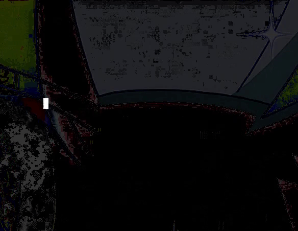

An interactive implementation of Conway's game of life for your terminal  
Made with Rust and Termion




<sub>(Made to learn the basics of Rust so the code might not be the best)</sub>  

## Compiling and running
```cargo run --release```

## Features
- Play/pause the game (spacebar)
- Move around the board (arrow keys) and edit cells (A)
- Easily randomize (R) or clear the board (C)
- Adjustable framerate (-/+ keys)
- Advance the game by one frame at a time when paused (F)
- ASCII mode for terminals that don't display the unicode cells properly (U)
- Hide the cursor (H)

by default the size of the board will be set to fill your terminal completely. You can run it with a custom width and height using `--height` and `--width` arguments as shown below:  
```cargo run --release -- --height <height> --width <width>```